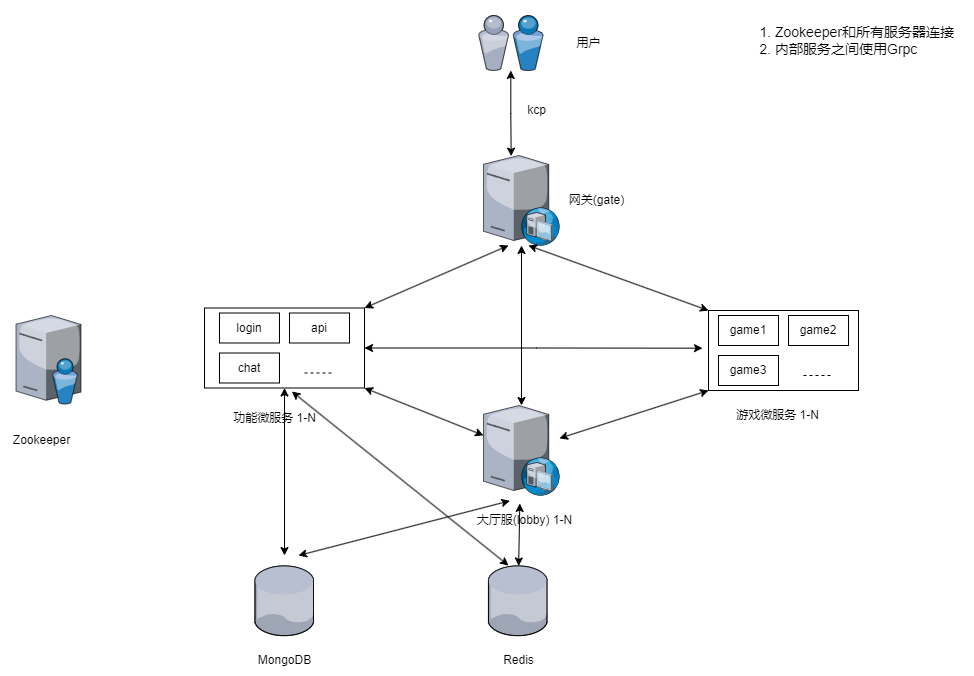

# UGK-Server

&emsp;&emsp;快节奏多人联网游戏Demo，UGK-Server：unity、go、kcp server 。
服务器使用微服务架构，服务器端游戏逻辑需要物理碰撞、寻路的使用Unity、C#开发，其他使用Go开发。
对应客户端[ugk-client](https://github.com/jzyong/ugk-client)。 开发中......

## 特性
* 微服务架构
* 前后端分离
* 自动化编排Docker容器(Unity dedicated server)
* 快照同步，状态同步预测插值

### 前后端分离
* 减少服务器所需要的资源，最小化unity服务器资源内存、cpu消耗
* 游戏逻辑更加简单明了
* 可以减少网络带宽（Mirror和Unity官方的组件都封装了Spawn和Despawn，需要额外的消息同步特效，音效等）

## 服务
### 通用
| 服务	                | 描述                        |
|--------------------|---------------------------|
| ugk-agent          | docker中运行的unity服务器的创建与销毁  |
| ugk-agent-manager  | 管理ugk-agent服务，为玩家房间分配游戏进程 |
| ugk-api            | HTTP Restful请求接口          |
| ugk-charge         | 充值                        |
| ugk-chat           | 聊天                        |
| ugk-common         | 公共逻辑封装                    |
| ugk-game           | 游戏微服务                     |
| ugk-gate           | 网关，消息转换                   |
| ugk-lobby          | 大厅，一般逻辑                   |
| ugk-login          | 登录、账号                     |
| ugk-message        | 协议消息                      |
| ugk-resource       | 文档、脚本                     |
| ugk-stress-testing | 压力测试客户端集群                 |

### 游戏
| 游戏	                                                               | 描述         |
|-------------------------------------------------------------------|------------|
| [game-galactic-kittens](ugk-game/game-galactic-kittens/README.md) | 2D多人飞船射击游戏 |

## 技术选择
* Unity、C# 客户端和服务器
* Go 服务器
* Kcp 网络通信 客户端和网关，网关和后端服务通信
* Protobuf+Grpc 内部网络通信
* Zookeeper 服务发现注册
* Mongodb,Redis 数据存储
* Docker、Jenkins 进行CI/CD

### 参考资料
#### 网络
* [Mirror](https://github.com/MirrorNetworking/Mirror)
* [Unity Multiplayer Networking](https://github.com/Unity-Technologies/com.unity.netcode.gameobjects)
* [FishNet](https://github.com/FirstGearGames/FishNet/)
* [Telepathy](https://github.com/vis2k/Telepathy) TCP前端
* [kcp2k](https://github.com/vis2k/kcp2k) unity前端
* [kcp-go](https://github.com/xtaci/kcp-go) go服务器
* [grpc](https://grpc.io/) 服务器之间通信··
* [可靠UDP，KCP协议快在哪？](https://wetest.qq.com/lab/view/391.html)
#### 同步
* [Prediction,Reconciliation,Lag Compensation](https://www.gabrielgambetta.com/client-server-game-architecture.html)
* [Latency Compensating Methods in Client/Server In-game Protocol Design and Optimization](https://developer.valvesoftware.com/wiki/Latency_Compensating_Methods_in_Client/Server_In-game_Protocol_Design_and_Optimization)
* [无畏契约网络代码](https://technology.riotgames.com/news/peeking-valorants-netcode)
#### Unity
* [com.unity.multiplayer.samples.bitesize](https://github.com/Unity-Technologies/com.unity.multiplayer.samples.bitesize)小游戏示例demo
* [GalacticKittens](https://github.com/UnityTechnologies/GalacticKittens) 2D示例demo

## TODO
* GalacticKittens --> [Client Driven Overview]((https://github.com/Unity-Technologies/com.unity.multiplayer.samples.bitesize))
* GalacticKittens 血量，UI；音效调优；添加护盾开启关闭消息；场景切换渐入渐出效果;能量，boss；
* 大厅玩家UI（头像-ID）
* agent 进程会无故关闭？
* 网关CPU，内存消耗高，进行分析？
* 添加boss子弹碰撞

### 计划
* Websocket网络通信
* 压力测试客户端使用ugk-web开发界面（vue3）
* 添加聊天、排行、匹配、房间（Mirror）服务
* 广告、充值接取
* 使用c#开发导表等图形化工具
* 服务器unity提取公共包，unity的package
* ugk-client 弹窗增加tween动画
* 后台管理系统查看unity docker服务器
* Limits how often data is sent for objects distance to players to reduce how much bandwidth the server uses. Tests show this feature can reduce transform updates, such as moving objects, between 90-97%. FishNet解决方案，远的对象，减少同步频率
* 压力测试，网关CPU、内存消耗高？
* 打android包测试，使用StarterAssets中的资源
* lua热更新

交流讨论
---------
* **QQ群：** 236076532

感谢
---------

